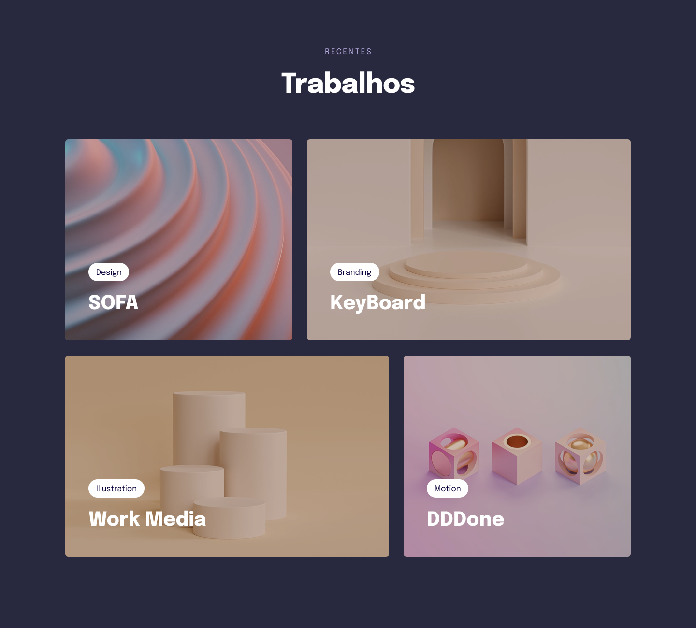

## 💻 Projeto

 Nesse projeto eu tabalhei com: display: grid, transições, animações e responsividade.

 

  
  

## 📝 Licença

Esse projeto está sob a licença MIT. Veja o arquivo [LICENSE](LICENSE) para mais detalhes.
